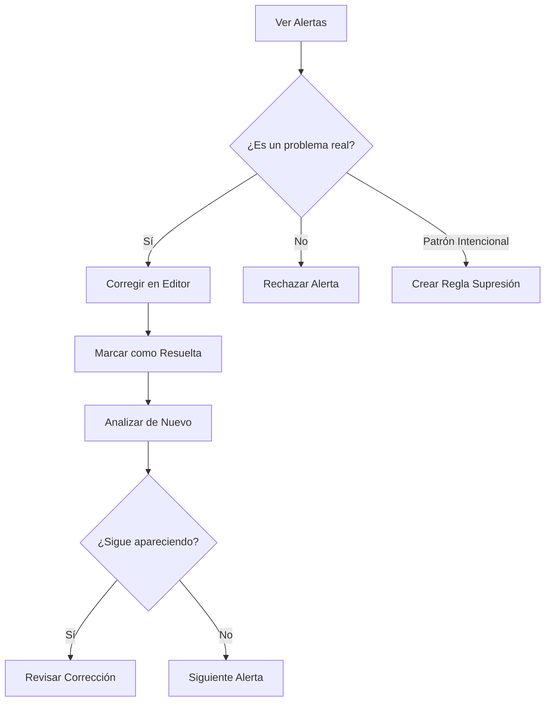

# Alertas de Inconsistencia

Las **alertas** son las inconsistencias detectadas por el sistema que requieren tu revisión manual.

---

## Tipos de Alertas

### Por Categoría

| Categoría | Descripción | Ejemplo |
|-----------|-------------|---------|
| **Personajes** | Atributos contradictorios | Edad que no concuerda con el tiempo transcurrido |
| **Timeline** | Problemas temporales | "Nació en 1990" pero "en 2010 tenía 25 años" |
| **Diálogos** | Atribución incorrecta | Hablante equivocado o cambio de registro |
| **Relaciones** | Vínculos contradictorios | "hermano" en un capítulo, "primo" en otro |
| **Calidad** | Repeticiones, muletillas | "de repente" aparece 47 veces |

### Por Severidad

!!! danger "Crítica"
    Contradicciones claras que requieren corrección inmediata.

    Ejemplo: Personaje muere en capítulo 5, aparece vivo en capítulo 10.

!!! warning "Alta"
    Inconsistencias probables que debes revisar.

    Ejemplo: Edad incoherente con timeline.

!!! info "Media"
    Posibles problemas que podrían ser intencionales.

    Ejemplo: Cambio de registro en diálogo.

!!! note "Baja"
    Sugerencias de estilo o calidad.

    Ejemplo: Repetición de palabra en mismo párrafo.

---

## Interfaz de Alertas

### Vista Principal

```
┌──────────────────────────────────────────────┐
│ Filtros: [Categoría▼] [Severidad▼] [Estado▼]│
├──────────────────────────────────────────────┤
│ 🔴 ALTA │ Inconsistencia de Edad             │
│ Cap. 3  │ "María tiene 25 años"              │
│ Cap. 12 │ "María cumplió 30 años"            │
│         │ ⚠️ Solo pasan 2 meses en historia  │
├──────────────────────────────────────────────┤
│ 🟡 MEDIA│ Cambio de Registro                 │
│ Cap. 5  │ Formal → Coloquial sin justificar  │
└──────────────────────────────────────────────┘
```

### Navegar al Texto

1. **Haz clic** en la alerta
2. Se abre el **visor de documento**
3. El texto problemático aparece **resaltado**
4. Puedes ver el **contexto completo** del capítulo

---

## Filtros Avanzados

### Por Entidad

:material-filter: Muestra solo alertas de un personaje específico.

**Uso**: Para revisar todas las inconsistencias de "María González" de una vez.

### Por Categoría

:material-filter: Filtra por tipo de problema.

**Uso**: Revisar primero todas las de timeline, luego diálogos, etc.

### Por Preset

!!! tip "Presets de Filtrado"
    === "Críticas Primero"
        Solo alertas críticas y altas para revisión urgente.

    === "Por Capítulo"
        Agrupa alertas por capítulo para corregir secuencialmente.

    === "Sin Resolver"
        Oculta alertas ya marcadas como resueltas o rechazadas.

---

## Gestionar Alertas

### Marcar como Resuelta

Cuando ya has corregido el problema en tu manuscrito:

1. Haz clic en :material-check: **Resolver**
2. La alerta se marca como resuelta
3. **Desaparecerá** en el próximo análisis si el problema está corregido

### Rechazar (Falso Positivo)

Si la alerta es incorrecta o el "problema" es intencional:

1. Haz clic en :material-close: **Rechazar**
2. La alerta se oculta permanentemente
3. No volverá a aparecer en futuros análisis

!!! example "Ejemplo de Rechazo Justificado"
    **Alerta**: "El personaje cambió de nombre de María a Mari"

    **Tu decisión**: Es una evolución intencional (apodo cariñoso que adquiere con el tiempo).

    **Acción**: Rechazar la alerta.

### Reglas de Supresión

Para patrones que se repiten y **no** quieres que el sistema siga alertando:

1. Desde una alerta, haz clic en **"Crear Regla"**
2. Define el patrón a suprimir
3. El sistema **no volverá a alertar** sobre ese patrón

!!! warning "Usa con cuidado"
    Las reglas de supresión afectan a **todo el proyecto**. Solo úsalas cuando estés seguro de que el patrón es intencional.

---

## Exportar Alertas

Para compartir con otros correctores o llevar un registro:

### Formatos

=== "CSV"
    Para Excel o Google Sheets
    ```csv
    severidad,categoría,capítulo,descripción
    ALTA,personajes,3,"Edad inconsistente: María..."
    ```

=== "PDF"
    Informe imprimible con todas las alertas

=== "JSON"
    Formato técnico para procesamiento automatizado

### Contenido del Export

- Severidad y categoría
- Capítulo y línea
- Descripción del problema
- Contexto textual
- Estado (resuelta/pendiente/rechazada)

---

## Flujo de Trabajo Recomendado



---

## Consejos

!!! tip "Priorización"
    1. Revisa **alertas críticas** primero (muerte, edad, hechos)
    2. Luego **altas** (timeline, relaciones)
    3. Finalmente **medias y bajas** (calidad, estilo)

!!! tip "Contexto"
    Siempre lee el **contexto completo** antes de decidir. A veces lo que parece un error tiene justificación narrativa.

!!! tip "Segunda Opinión"
    Si dudas, marca la alerta y consúltala con otro corrector o con el autor.

---

## Problemas Comunes

??? question "Muchos falsos positivos en diálogos"
    **Causa**: El sistema tiene dificultad con diálogos sin guion o formato inconsistente.

    **Solución**: Crea una regla de supresión para ese patrón o ajusta la sensibilidad en Configuración.

??? question "No aparece una inconsistencia obvia"
    **Causa**: El sistema no detectó las entidades relacionadas o la formulación es muy sutil.

    **Solución**: Revisa que las entidades estén correctamente fusionadas. Si el problema persiste, repórtalo como mejora.

??? question "Alerta sigue apareciendo tras corregirla"
    **Causa**: El cambio en el manuscrito no fue suficiente o no reimportaste el documento.

    **Solución**: Reimporta el documento actualizado y vuelve a analizar.

---

## Próximos Pasos

- [Timeline y Eventos](timeline-events.md)
- [Colecciones y Sagas](collections-sagas.md)
- [Configuración](settings.md)
