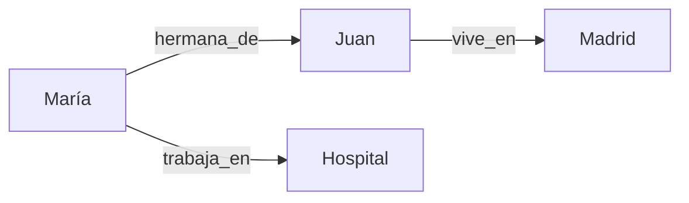

# Gestión de Entidades

Las **entidades** son los elementos clave del manuscrito: personajes, lugares, organizaciones.

---

## Tipos de Entidades

| Tipo | Icono | Descripción | Ejemplos |
|------|-------|-------------|----------|
| **PER** | :material-account: | Personas | María González, Dr. López |
| **LOC** | :material-map-marker: | Lugares | Madrid, Hospital Central |
| **ORG** | :material-domain: | Organizaciones | Ministerio, ONG Esperanza |
| **EVENT** | :material-calendar: | Eventos | Boda de María, Incendio |
| **OBJECT** | :material-cube: | Objetos | Espada mágica, Diario |
| **OTHER** | :material-help-circle: | Otros | Amor, Justicia |

---

## Vista de Entidades

### Interfaz

```
┌─────────────────────────────────────────────┐
│ 🔍 [Buscar entidades...]                    │
│ Filtros: [Tipo▼] [Menciones▼] [Atributos▼] │
├─────────────────────────────────────────────┤
│ María González   │ PER │ 145 │ edad:25     │
│ Juan Pérez       │ PER │ 89  │ edad:30     │
│ Madrid           │ LOC │ 34  │ país        │
└─────────────────────────────────────────────┘
```

---

## Fusionar Entidades Duplicadas

!!! warning "Problema Común"
    El NER detecta la misma entidad con nombres distintos:

    - María, Mari, Sra. González, La doctora → **Mismo personaje**

### Cómo Fusionar

1. Selecciona **entidad primaria** (la que quieres mantener)
2. Haz clic en **"Fusionar"**
3. Selecciona **secundarias** (duplicados)
4. Confirma

!!! success "Resultado"
    ```
    Antes:
    - María González (145 menciones)
    - Mari (23 menciones)

    Después:
    - María González (168 menciones) ✅
    ```

---

## Atributos

### Categorías de Atributos (Personajes)

=== "Físicos"
    - edad, altura, color_ojos, color_pelo
    - complexión, rasgos_distintivos

=== "Profesionales"
    - profesión, ocupación, rango
    - especialidad, experiencia

=== "Relacionales"
    - padre_de, hermano_de, esposo_de
    - jefe_de, amigo_de

=== "Temporales"
    - fecha_nacimiento, fecha_muerte
    - edad_en_evento

### Gestión

??? example "Ver Atributos"
    ```
    ┌─────────────┬──────────┬────────────┐
    │ Atributo    │ Valor    │ Confianza  │
    ├─────────────┼──────────┼────────────┤
    │ edad        │ 25 años  │ 95%        │
    │ profesión   │ médica   │ 90%        │
    │ color_ojos  │ azules   │ 85%        │
    └─────────────┴──────────┴────────────┘
    ```

??? example "Añadir Atributo"
    1. Click en **"Añadir Atributo"**
    2. Completa:
        - **Categoría**: physical
        - **Nombre**: color_ojos
        - **Valor**: azules
    3. Guarda

---

## Relaciones

Conectan entidades entre sí:



### Añadir Relación

1. Selecciona entidad
2. Click en **"Añadir Relación"**
3. Completa:
    - **Tipo**: hermano_de, trabaja_en, vive_en
    - **Destino**: Otra entidad
4. Guarda

---

## Filtros

### Por Tipo

:material-filter: `PER` → Solo personajes

### Por Menciones

:material-filter: `> 50 menciones` → Principales
:material-filter: `10-50 menciones` → Secundarios
:material-filter: `< 10 menciones` → Menores

!!! tip "Falsos positivos"
    Personajes con < 3 menciones a menudo son nombres comunes mal detectados.

---

## Exportar

Formatos disponibles:

=== "CSV"
    Para Excel, Google Sheets
    ```csv
    nombre,tipo,menciones,edad,profesión
    María González,PER,145,25,médica
    ```

=== "JSON"
    Para procesamiento programático
    ```json
    {
      "entities": [
        {
          "name": "María González",
          "type": "PER",
          "mentions": 145
        }
      ]
    }
    ```

=== "Markdown"
    Fichas de personajes legibles
    ```markdown
    ## María González
    - Tipo: Personaje principal
    - Menciones: 145
    - Edad: 25 años
    ```

---

## Casos de Uso

!!! example "Detectar Personajes Sin Caracterización"
    1. Filtrar por `Menciones > 20`
    2. Ordenar por `Atributos` ascendente
    3. Revisar personajes con 0-2 atributos

!!! example "Encontrar Nombres Similares"
    1. Buscar `Juan`
    2. Revisar: Juan, Juanito, Sr. Pérez
    3. Fusionar duplicados

---

## Próximos Pasos

- [Trabajar con Alertas](alerts.md)
- [Timeline y Eventos](timeline-events.md)
