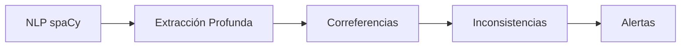
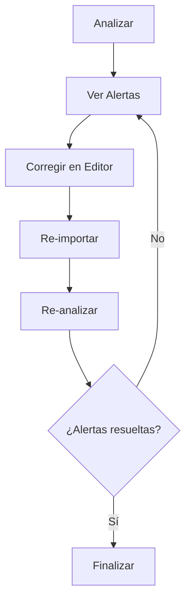

# Primer Análisis

Guía paso a paso para tu primer análisis de manuscrito.

---

## Paso 1: Crear un Proyecto

1. **Abre** Narrative Assistant
2. Haz clic en **"Nuevo Proyecto"**
3. Completa el formulario:

| Campo | Descripción | Requerido |
|-------|-------------|-----------|
| **Título** | Nombre del manuscrito | ✅ |
| **Autor** | Tu nombre o seudónimo | ✅ |
| **Género** | Novela, Técnico, Jurídico, etc. | ❌ |
| **Descripción** | Sinopsis breve | ❌ |

4. Haz clic en **"Crear"**

---

## Paso 2: Importar el Documento

### Formatos Soportados

=== "DOCX (Recomendado)"
    - ✅ Preserva capítulos y estructura
    - ✅ Mejor detección de formato
    - ✅ Soporte completo de estilos

=== "TXT"
    - ✅ Simple y rápido
    - ✅ Sin dependencias de formato
    - ⚠️ Requiere separación manual de capítulos

=== "Markdown"
    - ✅ Ideal para escritores técnicos
    - ✅ Capítulos con `# Título`
    - ✅ Formato preservado

=== "PDF / EPUB"
    - ⚠️ Solo texto (no OCR)
    - ⚠️ Puede perder formato
    - ⚠️ No recomendado si hay alternativa

### Importar

1. **Abre** el proyecto creado
2. Haz clic en **"Importar Documento"**
3. Selecciona el archivo
4. **Espera** mientras se procesa (10-30 segundos)

!!! success "Progreso"
    ```
    📄 Leyendo archivo...
    🔍 Detectando estructura...
    📝 Extrayendo capítulos...
    ✅ Documento cargado (45 capítulos, 120.000 palabras)
    ```

---

## Paso 3: Ejecutar Análisis

### 3.1 Seleccionar Preset (Opcional)

!!! tip "Presets disponibles"
    === "Novela"
        - Máx. diálogo, personajes, timeline
        - Detección de inconsistencias de personajes
        - Timeline estricto

    === "Técnico"
        - Terminología consistente
        - Acrónimos validados
        - Sin análisis de diálogos

    === "Memoria"
        - Timeline muy estricto
        - Coherencia temporal crítica
        - Validación de fechas

### 3.2 Iniciar Análisis

1. Haz clic en **"Analizar"**
2. Confirma configuración
3. **Espera** (2-10 minutos según tamaño)

**Fases del análisis**:



!!! info "Progreso detallado"
    1. **Fase 1**: Análisis NLP (tokenización, POS, NER)
    2. **Fase 2**: Extracción (atributos, relaciones, eventos)
    3. **Fase 3**: Correferencias (fusión de menciones)
    4. **Fase 4**: Inconsistencias (detección)
    5. **Fase 5**: Alertas (priorización)

---

## Paso 4: Interpretar Resultados

### Dashboard Principal

<div class="grid cards" markdown>

-   :material-view-dashboard:{ .lg } __Vista General__

    ---

    - 245 entidades detectadas
    - 67 alertas generadas
    - 45 capítulos analizados

-   :material-account-multiple:{ .lg } __Entidades__

    ---

    - 180 personajes
    - 35 lugares
    - 30 otros

-   :material-alert:{ .lg } __Alertas__

    ---

    - 12 críticas
    - 35 altas
    - 20 medias

-   :material-clock:{ .lg } __Timeline__

    ---

    - 45 eventos clave
    - 3 contradicciones temporales

</div>

### Ejemplo de Alerta Crítica

!!! danger "Inconsistencia de Edad"
    **Capítulo 3, línea 145:**
    > "María tiene 25 años y trabaja como médica desde hace 5 años."

    **Capítulo 12, línea 892:**
    > "Cuando María cumplió 30, ya llevaba 8 años ejerciendo medicina."

    **⚠️ Problema**: Entre cap. 3 y 12 pasan solo 2 meses de historia, pero María envejece 5 años.

    **Confianza**: 95%

---

## Paso 5: Flujo de Trabajo

### Iterativo



### Priorización Recomendada

1. **Alertas críticas** primero (edad, muerte, contradicciones)
2. **Fusionar duplicados** (mejora precisión)
3. **Alertas de calidad** al final (repeticiones, muletillas)

---

## Consejos

!!! tip "DO"
    - ✅ Revisa manualmente cada alerta
    - ✅ Fusiona duplicados cuanto antes
    - ✅ Usa presets como punto de partida
    - ✅ Guarda backups antes de cambios

!!! warning "DON'T"
    - ❌ No confíes ciegamente (hay falsos positivos)
    - ❌ No uses "Aplicar Todo" sin revisar
    - ❌ No analices textos muy cortos (< 5.000 palabras)

---

## Problemas Comunes

??? question "El análisis tarda mucho (> 10 min)"
    **Causa**: Manuscrito muy largo o LLM lento

    **Solución**: Desactiva análisis LLM en Settings

??? question "Muchas alertas falsas de diálogos"
    **Causa**: Preset demasiado estricto

    **Solución**: Ajusta sensibilidad en Settings → Diálogos

??? question "No detecta personaje obvio"
    **Causa**: Nombre ambiguo o menciones dispersas

    **Solución**: Añade la entidad manualmente

---

## Próximos Pasos

<div class="grid cards" markdown>

-   :material-account-multiple:{ .lg } __[Gestión de Entidades](entities.md)__

    ---

    Fusionar duplicados, editar atributos, gestionar menciones.

-   :material-alert:{ .lg } __[Trabajar con Alertas](alerts.md)__

    ---

    Filtrar, priorizar, resolver inconsistencias.

-   :material-cog:{ .lg } __[Configuración](settings.md)__

    ---

    Ajustar presets, sensibilidad, modelos LLM.

</div>
